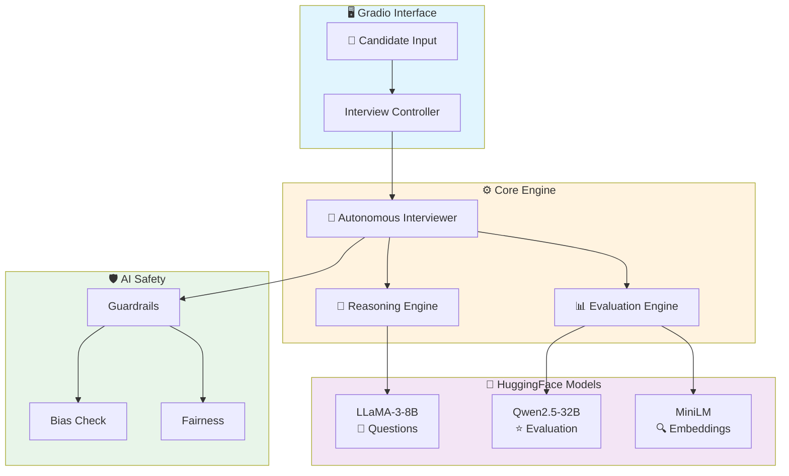
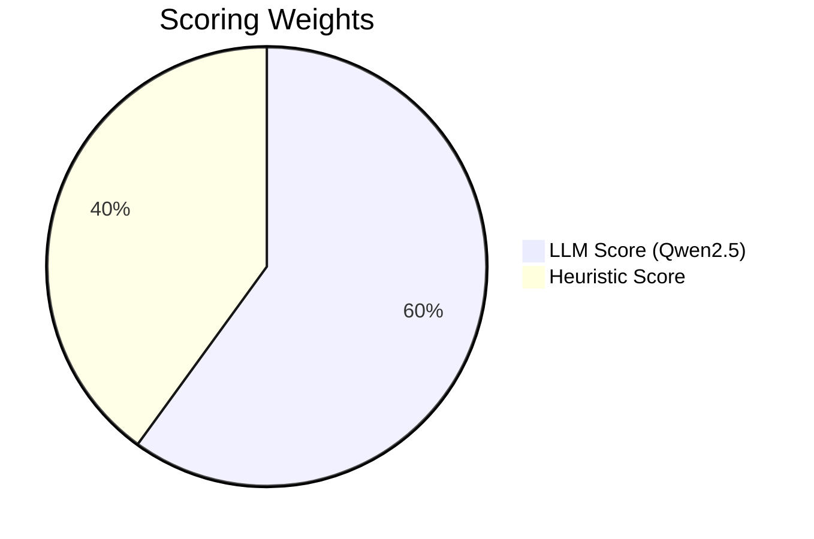

<div align="center">

# 🤖 Autonomous AI Technical Interviewer

### *Your AI-Powered Interview Coach with Human-Like Intelligence*

[](https://huggingface.co/spaces/Vikas9793/ai-interviewer)
[](https://python.org)
[](LICENSE)

[](https://langchain.com)
[](https://huggingface.co)
[](https://gradio.app)

---

**Self-thinking AI** • **Chain-of-Thought Reasoning** • **Hybrid Evaluation** • **Responsible AI**

[Try Live Demo](https://huggingface.co/spaces/Vikas9793/ai-interviewer) · [Documentation](docs/) · [Report Bug](https://github.com/VIKAS9793/ai-interviewer-langchain/issues)

</div>

---

## ✨ Features at a Glance

<table>
<tr>
<td width="50%">

### 🧠 Intelligent Reasoning
- Chain-of-Thought before every action
- Self-reflection and improvement
- Adaptive difficulty adjustment

</td>
<td width="50%">

### 📊 Hybrid Evaluation
- Dual-model scoring (LLaMA + Qwen2.5)
- Prometheus-style 1-5 rubric
- Semantic relevance checking

</td>
</tr>
<tr>
<td width="50%">

### 🛡️ Responsible AI
- Bias detection & mitigation
- Fairness validation
- Transparent decision-making

</td>
<td width="50%">

### ⚡ Cloud-Native
- HuggingFace Spaces ready
- No GPU required
- Instant deployment

</td>
</tr>
</table>

---

## 🏗️ System Architecture



---

## 📊 Evaluation System



| Score | Level | Description |
|:-----:|:------|:------------|
| ⭐⭐⭐⭐⭐ | **Exceptional** | Comprehensive, accurate, well-structured with examples |
| ⭐⭐⭐⭐ | **Good** | Covers main concepts correctly, minor gaps |
| ⭐⭐⭐ | **Adequate** | Addresses question but lacks depth |
| ⭐⭐ | **Limited** | Partially relevant, significant gaps |
| ⭐ | **Poor** | Off-topic or incorrect |

---

## � Quick Start

### Live Demo (Recommended)
```
🌐 https://huggingface.co/spaces/Vikas9793/ai-interviewer
```

### Local Installation
```bash
# Clone & Setup
git clone https://github.com/VIKAS9793/ai-interviewer-langchain.git
cd ai-interviewer-langchain
pip install -r requirements.txt

# Configure & Run
export HF_TOKEN="your_token"
python main.py
```

---

## � Tech Stack

| Component | Technology |
|-----------|------------|
| **Framework** | LangChain + Gradio |
| **Question Gen** | Meta-Llama-3-8B-Instruct |
| **Evaluation** | Qwen2.5-32B-Instruct |
| **Embeddings** | Sentence Transformers |
| **Deployment** | HuggingFace Spaces |

---

## 📚 Interview Topics

- 💻 JavaScript/Frontend Development
- 🐍 Python/Backend Development
- 🤖 Machine Learning/AI
- 🏗️ System Design
- 📈 Data Structures & Algorithms

---

## 📖 Documentation

| Document | Description |
|----------|-------------|
| [Setup Guide](docs/SETUP.md) | Installation instructions |
| [Architecture](docs/ARCHITECTURE.md) | System design & diagrams |
| [ADR](docs/ADR.md) | Architectural decisions |
| [Roadmap](docs/ROADMAP.md) | Future plans |
| [Changelog](CHANGELOG.md) | Version history |

---

## 🤝 Contributing

Contributions welcome! See [CONTRIBUTING.md](CONTRIBUTING.md).

---

<div align="center">

### ⭐ Star this repo if you find it useful!

**Built with ❤️ using LangChain, HuggingFace, and Gradio**

[](https://github.com/VIKAS9793/ai-interviewer-langchain)

</div>