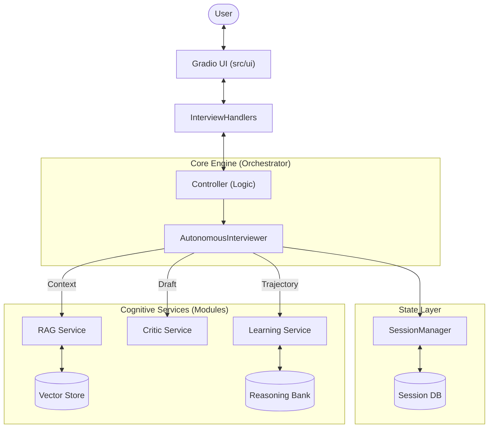
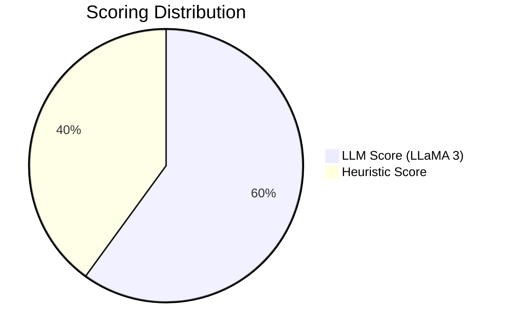

<div align="center">

# 🤖 Autonomous AI Technical Interviewer

### *Your AI-Powered Interview Coach with Human-Like Intelligence*

[](https://huggingface.co/spaces/Vikas9793/ai-interviewer)
[](https://github.com/VIKAS9793/ai-interviewer-langchain)
[](https://github.com/VIKAS9793/ai-interviewer-langchain/actions)
[](LICENSE)


**Self-Thinking AI** • **Chain-of-Thought** • **Autonomous Reasoning** • **Responsible AI**

</div>

---

## ✨ Features at a Glance

<table>
<tr>
<td width="50%">

### 🧠 Intelligent Reasoning
- Chain-of-Thought before every action
- Self-reflection and improvement
- Adaptive difficulty adjustment

</td>
<td width="50%">

### 📊 Autonomous Evaluation
- Single-Model Architecture (LLaMA 3)
- Prometheus-style 1-5 rubric
- Semantic relevance checking

</td>
</tr>
</tr>
<tr>
<td width="50%">

### 🛡️ Responsible AI
- Bias detection & mitigation
- Fairness validation
- Transparent decision-making

</td>
<td width="50%">

### 🎤 Voice Mode (v2.4)
- Browser-native Speech-to-Text
- AI response read aloud
- Zero external API calls

</td>
</tr>
<tr>
<td width="50%">

### 📄 Practice Mode (v2.5)
- Resume upload (PDF/DOCX)
- JD URL scraping
- Role & experience detection

</td>
<tr>
<td width="50%">

### 🏢 Company Intelligence (v3.2)
- Strategy Injection (Amazon/Google/Meta)
- JD Parsing & Context Extraction
- Adaptive questioning based on company culture

</td>
<td width="50%">

### 🔒 Security
- File magic byte validation
- Macro/script detection
- XSS prevention
- SSRF protection (URL validation)
- Comprehensive input validation
- Session expiration & cleanup
- Error message sanitization

</td>
</table>

---

## ⚠️ Current Limitations (Please Read)

> **This is an AI practice tool, not a replacement for real interviews.**

| What Works Well | What May Vary |
|-----------------|---------------|
| ✅ Detects common skills (Python, React, AWS, etc.) | ⚠️ May miss niche or proprietary technologies |
| ✅ Generates adaptive questions | ⚠️ Questions may occasionally repeat |
| ✅ Provides score-based feedback | ⚠️ Feedback is AI-generated, not human-reviewed |
| ✅ Works with most resumes (PDF/DOCX) | ⚠️ Complex resume layouts may not parse correctly |

**Best Experience:** For personalized feedback, set `OPENAI_API_KEY` in your environment. Without it, the system uses free models with keyword-based skill detection.

---

## 📚 Supported Interview Topics

| Domain | Focus Areas |
|--------|-------------|
| **Python/Backend** | FastAPI/Flask, Asyncio, ORM, Django, REST APIs |
| **JavaScript/Frontend** | React, Vue, Modern JS (ES6+), DOM, Web Performance |
| **System Design & Architecture** | Scalability, Microservices, Load Balancing, Caching |
| **Data Structures & Algorithms** | Trees, Graphs, DP, Sorting, Complexity Analysis |
| **Machine Learning/AI** | Transformers, Deep Learning, NLP, RAG Pipelines |
| **Cloud & DevOps** | AWS/GCP/Azure, Docker/K8s, CI/CD, Terraform |
| **Database & SQL** | SQL, NoSQL, Indexing, Query Optimization |
| **API Design & REST** | RESTful Design, GraphQL, Authentication, Rate Limiting |

---

## 🏗️ System Architecture



> 📖 **Deep Dive:** See [LangGraph Architecture](docs/LANGGRAPH_ARCHITECTURE.md) for the internal state machine diagram.

---

## 📊 Evaluation System



| Score | Level | Criteria |
|:-----:|:------|:---------|
| ⭐⭐⭐⭐⭐ | **Exceptional** | Comprehensive, accurate, well-structured with examples |
| ⭐⭐⭐⭐ | **Good** | Covers main concepts correctly |
| ⭐⭐⭐ | **Adequate** | Addresses question but lacks depth |
| ⭐⭐ | **Limited** | Partially relevant, gaps/errors |
| ⭐ | **Poor** | Off-topic or incorrect |

---

## 🚀 Quick Start

### ☁️ Live Demo (Recommended)

<div align="center">

[](https://huggingface.co/spaces/Vikas9793/ai-interviewer)

</div>

### 💻 Local Installation
```bash
# Clone & Setup
git clone https://github.com/VIKAS9793/ai-interviewer-langchain.git
cd ai-interviewer-langchain
pip install -r requirements.txt

# Configure & Run
export HF_TOKEN="your_token"
python main.py
```

---

## 📖 Documentation

| Document | Description |
|----------|-------------|
| 📋 [Setup Guide](docs/SETUP.md) | Installation & configuration |
| 🏗️ [Architecture](docs/ARCHITECTURE.md) | System design & diagrams |
| 📝 [ADR](docs/ADR.md) | Architectural decisions |
| 🗺️ [Roadmap](docs/ROADMAP.md) | Future plans |
| 🔧 [Troubleshooting](docs/TROUBLESHOOTING.md) | Common issues |
| 🔒 [Security Audit](docs/AUDIT_REPORT.md) | Security audit findings |
| 🛡️ [Security Implementation](docs/SECURITY_IMPLEMENTATION.md) | Security fixes & hardening |
| 📜 [Changelog](docs/CHANGELOG.md) | Version history |
| 📝 [Release Notes](docs/RELEASE_NOTES.md) | Detailed release information |
| 🤝 [Contributing](docs/CONTRIBUTING.md) | Contribution guide |

---

## 🆘 Support & Feedback

*   🐛 **Found a bug?** [Open a Bug Report](https://github.com/VIKAS9793/ai-interviewer-langchain/issues/new?template=bug_report.md)
*   💡 **Have an idea?** [Request a Feature](https://github.com/VIKAS9793/ai-interviewer-langchain/issues/new?template=feature_request.md)
*   💬 **Questions?** [Join the Discussion](https://github.com/VIKAS9793/ai-interviewer-langchain/discussions)

---

## 📈 Version History

| Version | Date | Highlights |
|---------|------|------------|
| **v3.2.2** | 2025-12-14 | 🔒 **Security Hardening** (SSRF protection, input validation, session expiration) |
| **v3.2.1** | 2025-12-14 | 🧠 **Intelligence Hardening** (Fix loops, scoring, RAG verified) |
| **v3.2.0** | 2025-12-14 | 🏢 **Company Intelligence** (Strategy Injection) & 🏗️ **UI Modularization** (Clean Arch) |
| **v3.1.0** | 2025-12-12 | 🔷 LangGraph + JD Parser, Smart Role Parsing, Context-Aware Greetings |
| **v3.0.1** | 2025-12-12 | 🔥 Hotfix: Fixed scoring, question counter, feedback, topics |
| **v3.0.0** | 2025-12-12 | [**The Cognitive Upgrade**](docs/RELEASE_NOTES.md): Reasoning, RAG, Reflexion, Micro-Services |
| **v2.6.0** | 2025-12-12 | 🎨 UI Overhaul (Dark Mode, Pill Buttons, High Contrast) |
| **v2.5.1** | 2025-12-11 | Hotfix: Gradio 4.44 downgrade, Torch/Triton conflict |
| **v2.5.0** | 2025-12-11 | Practice Mode (Resume + JD), 11 bug fixes |
| **v2.4.0** | 2025-12-10 | Voice Mode (browser-native STT/TTS) |

---

<div align="center">

### ⭐ Star this repo if you find it useful!

[](https://github.com/VIKAS9793/ai-interviewer-langchain)
[](https://github.com/VIKAS9793/ai-interviewer-langchain/fork)

---

**Built with ❤️ using LangChain, HuggingFace, and Gradio**

[](LICENSE)

</div>