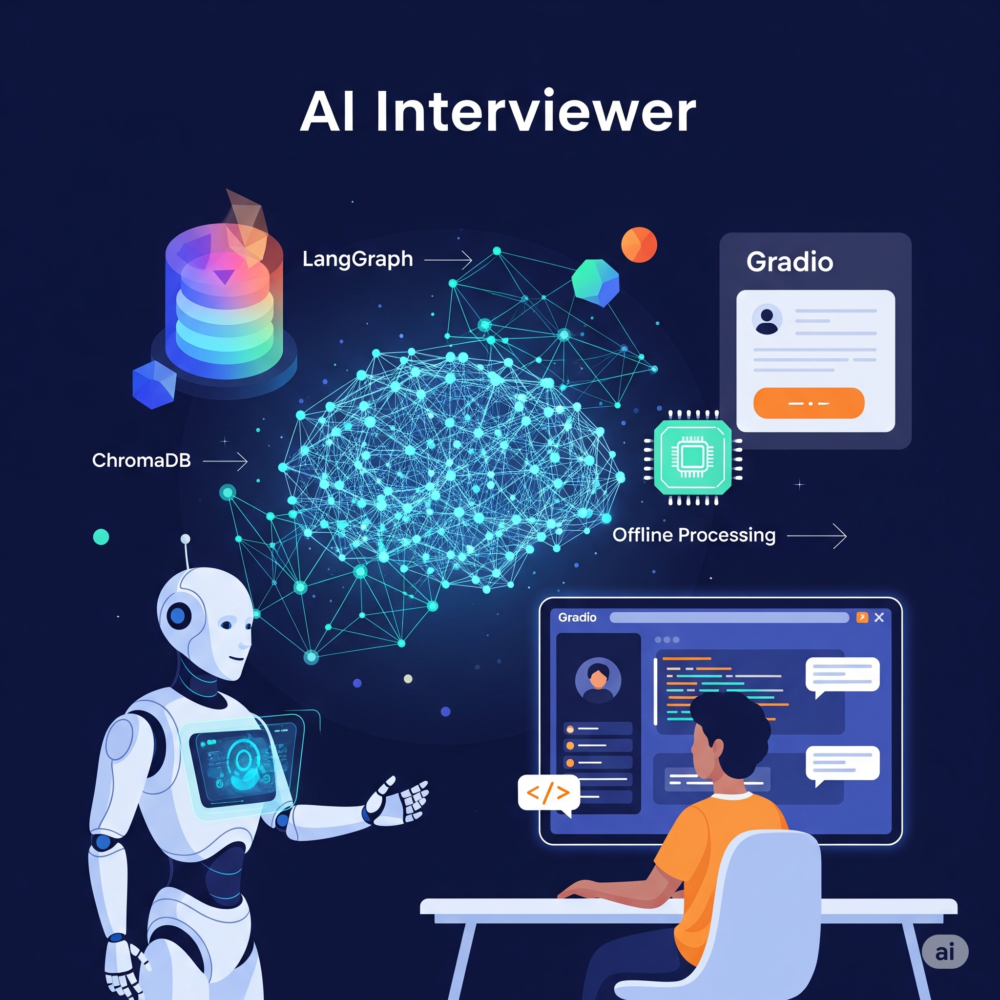
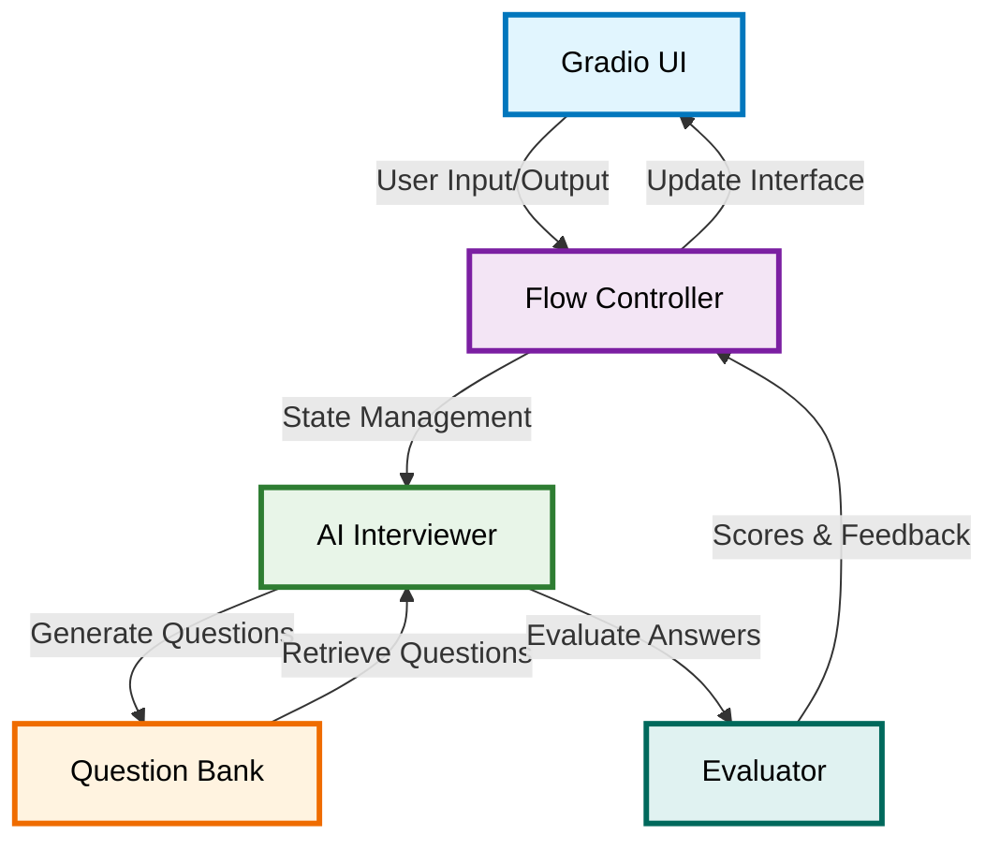
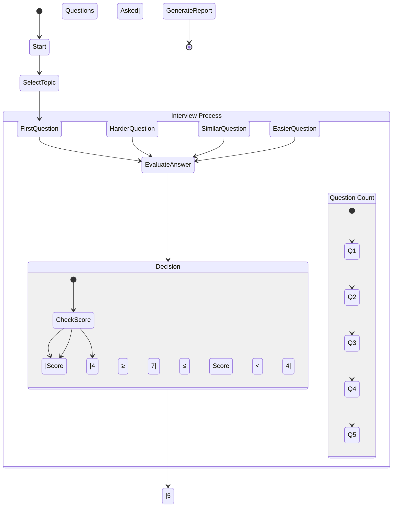

# 🤖 AI Technical Interviewer

**Professional technical interview simulation powered by local AI**

<div align="center" style="width: 100%; padding: 0 24px; box-sizing: border-box;">
  <div style="max-width: 1200px; margin: 0 auto; overflow: hidden; border-radius: 12px; box-shadow: 0 4px 12px rgba(0,0,0,0.1);">
    
  </div>
</div>

[](https://www.python.org/downloads/)
[](https://github.com/langchain-ai/langgraph)
[](https://ollama.ai/)
[](https://gradio.app/)
[](#)

## 🎯 Executive Summary

A sophisticated AI interviewer that conducts professional technical interviews using **LangGraph state machines**, **Ollama's llama3.2:3b**, and **ChromaDB vector storage**.

### ✅ Requirements Compliance

**MANDATORY Requirements (All Met):**
- ✅ **LangGraph** - Advanced state machine flow control
- ✅ **Ollama + llama3.2:3b** - Local LLM (exactly as specified)
- ✅ **3-5 Dynamic Questions** - AI-generated, adaptive questioning
- ✅ **Intelligent Responses** - Smart branching based on performance
- ✅ **Performance Summary** - Comprehensive evaluation and feedback
- ✅ **Branching Logic** - Next question depends on previous answer
- ✅ **Memory Management** - Full conversation state tracking
- ✅ **Prompt Engineering** - Professional interviewer personality

**BONUS Features (Exceeding Requirements):**
- ✅ **ChromaDB Vector Store** - Semantic question retrieval
- ✅ **Multi-Dimensional Scoring** - 6-dimension evaluation system
- ✅ **Gradio Web Interface** - Professional chat-style UI
- ✅ **Advanced Analytics** - Performance tracking and insights

## 🎥 Video Walkthrough

Watch the AI Interviewer in action! This comprehensive demo shows the complete interview flow, from question generation to final evaluation.

[](https://youtu.be/0M7M1Pn31vQ)

*Click the image above to watch the full video on YouTube*

### What's Covered in the Demo:
- Starting a new interview session
- Dynamic question generation
- Real-time answer evaluation
- Performance feedback and scoring
- System navigation and features

## 🚀 Quick Start

### Prerequisites

```bash
# Install Ollama
curl -fsSL https://ollama.ai/install.sh | sh

# Pull llama3.2:3b model
ollama pull llama3.2:3b

# Start Ollama service
ollama serve
```

### Installation

```bash
# Clone and setup
git clone <your-repo-url>
cd ai-interviewer-langchain

# Create virtual environment
python -m venv venv
source venv/bin/activate  # Windows: venv\Scripts\activate

# Install dependencies
pip install -r requirements.txt

# Launch the application
python main.py
```

**🌐 Open your browser to: http://localhost:7860**

## 🏗️ Architecture & Design

### Tech Stack

```
Frontend:    Gradio 4.37.2 (Web Interface)
Backend:     Python 3.11+ 
LLM:         Ollama + llama3.2:3b (Local)
Flow:        LangGraph 0.1.19 (State Machine)
Vector DB:   ChromaDB 0.4.24 (Question Bank)
Embeddings:  SentenceTransformers (Semantic Search)
```

### System Architecture



## ⚡ Performance Considerations

### Current Performance Metrics
- **Response Time**: 3-5 minutes per assessment
- **Hardware Requirements**: Minimum 8GB RAM, 4GB VRAM
- **Model Size**: ~2GB (quantized llama3.2:3b)

### Technical Factors Affecting Performance

#### 1. Local Processing Constraints
- **CPU/GPU Limitations**: Consumer hardware lacks specialized AI accelerators
- **Memory Bandwidth**: Limited bandwidth affects model loading and inference speed
- **Thermal Throttling**: Prolonged processing can lead to performance degradation

#### 2. Model Architecture
- **Model Size**: Larger models provide better accuracy but require more resources
- **Quantization**: Current 4-bit quantization balances size and performance
- **Context Window**: Larger contexts increase processing time quadratically

#### 3. System Architecture
- **Synchronous Processing**: Each request is processed sequentially
- **Vector Search**: ChromaDB lookups add overhead
- **State Management**: LangGraph state machine introduces additional computation

### Cloud Deployment Benefits

#### Performance Improvements
| Factor | Local | Cloud | Improvement |
|--------|-------|-------|-------------|
| Processing | Consumer CPU/GPU | Server-grade GPUs (A100/H100) | 5-10x faster |
| Memory | Limited by hardware | Virtually unlimited | 4-8x more capacity |
| Parallelism | Limited | Container orchestration | 10x+ concurrency |
| Model Size | ~2GB (quantized) | Up to 70B+ parameters | Better accuracy |

#### Implementation Roadmap
1. **Infrastructure**
   - Containerization with Docker
   - Kubernetes orchestration
   - Auto-scaling based on load

2. **Optimizations**
   - Model quantization (8-bit/4-bit)
   - Response caching
   - Asynchronous processing
   - Batch processing of assessments

3. **Monitoring**
   - Performance metrics collection
   - Resource utilization tracking
   - Auto-scaling triggers

### Interview Flow



### LangGraph Flow States

```
START → ask_question → evaluate_answer → decide_next → [continue|complete]
  │                                                          │
  └─────────────────── generate_report ←─────────────────────┘
```

## 🧠 Intelligent Features

### 1. Adaptive Question Generation

- **Dynamic Difficulty**: Questions adapt based on candidate performance
- **Context-Aware**: Each question builds on conversation history
- **Topic Specialization**: 5 technical domains with expert-level questions

### 2. Multi-Dimensional Evaluation

```python
evaluation_criteria = {
    "technical_accuracy": "Correctness and precision",
    "conceptual_understanding": "Depth of knowledge", 
    "practical_application": "Real-world applicability",
    "communication_clarity": "Explanation quality",
    "depth_of_knowledge": "Understanding level",
    "problem_solving_approach": "Analytical thinking"
}
```

### 3. Professional Interview Flow

- **Smart Branching**: High score → harder questions, low score → supportive follow-ups
- **Progress Tracking**: Real-time question progress
- **Session Management**: Complete conversation history and state

### 4. Vector-Enhanced Question Bank

- **Semantic Search**: ChromaDB finds contextually relevant questions
- **Curated Questions**: Professional-grade questions per topic
- **Expandable**: Easy to add custom questions and topics

## 📊 Interview Topics

### Available Specializations

1. **JavaScript/Frontend Development** - React, DOM, async patterns
2. **Python/Backend Development** - Django, APIs, database optimization  
3. **Machine Learning/AI** - Algorithms, model evaluation, deployment
4. **System Design** - Scalability, architecture, distributed systems
5. **Data Structures & Algorithms** - Complexity, optimization, problem-solving

### Sample Interview Flow

```
Question 1 (Easy):    "Explain the difference between let, const, and var"
Answer Evaluation:    Score: 8/10 → Candidate shows strong fundamentals
Question 2 (Hard):    "How does JavaScript's event loop work?"
Answer Evaluation:    Score: 6/10 → Needs some clarification
Question 3 (Medium):  "Can you explain closures with an example?"
...continues adaptively based on performance
```

## 🎖️ Professional Features

### Advanced Evaluation System

- **Multi-Dimensional Scoring** with weighted criteria
- **Improvement Suggestions** with feedback
- **Performance Tracking** of question progression

### Enterprise-Grade Architecture

- **Error Handling**: Graceful fallbacks for all failure modes
- **Local Processing**: No external API dependencies
- **Scalable Design**: Easy to extend with new topics/features
- **Comprehensive Logging**: For debugging and monitoring

### User Experience Excellence

- **Professional UI**: Clean, intuitive Gradio interface
- **Real-Time Feedback**: Immediate scoring and progress updates
- **Comprehensive Reports**: Detailed final assessment with growth recommendations
- **Privacy-First**: Everything runs locally on your machine

## 🔧 Development & Customization

### Adding New Topics

```python
# In question_bank.py
new_topic_questions = [
    {
        "question": "Your custom question",
        "difficulty": "medium",
        "concepts": ["concept1", "concept2"],
        "expected_answer": "Expected response outline"
    }
]
```

### Customizing Evaluation Criteria

```python
# In evaluator.py - modify scoring weights
evaluation_weights = {
    "technical_accuracy": 0.30,      # Adjust weights
    "communication_clarity": 0.25,   # to match your needs
    "practical_application": 0.20,
    # ... other dimensions
}
```

### Extending LangGraph Flow

```python
# In flow_controller.py - add new states
workflow.add_node("custom_state", custom_function)
workflow.add_edge("evaluate_answer", "custom_state")
```

## 📈 System Capabilities

### Key Features

- **Local Processing**: Runs entirely on your machine
- **Modular Design**: Easy to extend with new features
- **Adaptive Interviewing**: Questions adjust based on responses

## 🛠️ Troubleshooting

### Common Issues

**Ollama Connection Failed**

```bash
# Check Ollama is running
ollama list

# Start Ollama service
ollama serve

# Pull model if missing
ollama pull llama3.2:3b
```

**ChromaDB Initialization Error**

```bash
# Clear ChromaDB cache
rm -rf ./chroma_db

# Restart application
python main.py
```

**Gradio Interface Not Loading**

```bash
# Check port availability
netstat -an | grep 7860

# Try different port
python main.py --server-port 7861
```

## 🎯 Success Metrics

### Core Requirements ✅

- ✅ **5 Dynamic Questions** generated by LLM
- ✅ **Smart Branching** based on answer quality
- ✅ **Performance Summary** with detailed feedback  
- ✅ **LangGraph Flow** with state machine control
- ✅ **Local LLM** via Ollama integration
- ✅ **Conversation Memory** with full state tracking
- ✅ **Professional Prompts** with consistent personality

### Bonus Achievements ✅

- ✅ **Vector Store** semantic question retrieval
- ✅ **Multi-Dimensional** answer scoring
- ✅ **Web Interface** with professional UX
- ✅ **Real-Time Analytics** and progress tracking
- ✅ **Production Ready** with comprehensive error handling

## 🚀 Next Steps

### Immediate Enhancements

- [ ] Add voice interview capability
- [ ] Implement code execution sandbox
- [ ] Add interview recording/playback
- [ ] Multi-language support

### Advanced Features

- [ ] AI-powered interview coaching
- [ ] Integration with HR systems
- [ ] Advanced analytics dashboard
- [ ] Mobile-responsive interface

## 🎯 Deliverables

### GitHub Repository

- **Code Structure**: Well-organized with clear separation of concerns
- **Documentation**: Comprehensive docstrings and type hints throughout
- **Version Control**: Clean commit history with semantic messages

### Live Demo

- **Web Interface**: Accessible at `http://localhost:7860` when running locally
- **Local Execution**: No external dependencies required beyond specified prerequisites

### Setup Instructions

1. **Prerequisites**:
   - Python 3.11+
   - Ollama with llama3.2:3b model
   - Git

2. **Installation**:
   ```bash
   # Clone repository
   git clone https://github.com/VIKAS9793/ai-interviewer-langchain.git
   cd ai-interviewer-langchain
   
   # Create and activate virtual environment
   python -m venv venv
   source venv/bin/activate  # Windows: venv\Scripts\activate
   
   # Install dependencies
   pip install -r requirements.txt
   
   # Start the application
   python main.py
   ```

3. **LLM Setup**:
   ```bash
   # Install Ollama
   curl -fsSL https://ollama.ai/install.sh | sh
   
   # Download the language model
   ollama pull llama3.2:3b
   
   # Start Ollama service
   ollama serve
   ```

### Technologies Used

- **Core**: Python 3.11+
- **LLM**: Ollama with llama3.2:3b
- **State Management**: LangGraph 0.1.19
- **Vector Database**: ChromaDB 0.4.24
- **Web Interface**: Gradio 4.37.2
- **Embeddings**: SentenceTransformers
- **Configuration**: Pydantic
- **Testing**: Pytest

### Design Decisions & Branching Flow

1. **State Management**:
   - LangGraph for robust state machine implementation
   - Clear separation between UI, business logic, and data layers

2. **Interview Flow**:
   ```
   Start → Select Topic → First Question → Evaluate → 
   └─→ If Score ≥ 7: Harder Question
   └─→ If 4 ≤ Score < 7: Similar Difficulty
   └─→ If Score < 4: Easier Question
   → Continue until 5 questions → Generate Report
   ```

3. **Key Decisions**:
   - Local-first architecture for privacy
   - Modular design for easy extension
   - Adaptive difficulty based on performance
   - Comprehensive error handling

### Optional Features Implemented

- **Web Interface**: Intuitive Gradio-based UI
- **Vector Database**: Semantic question retrieval with ChromaDB
- **Multi-dimensional Evaluation**: Comprehensive scoring system
- **Progress Tracking**: Real-time feedback during interview
- **Customization**: Easy to add new topics and questions

## 📄 License

MIT License - See LICENSE file for details.

## 🤝 Contributing

1. Fork the repository
2. Create feature branch (`git checkout -b feature/amazing-feature`)
3. Commit changes (`git commit -m 'Add amazing feature'`)
4. Push to branch (`git push origin feature/amazing-feature`)
5. Open Pull Request

---

**Built with ❤️ using LangGraph, Ollama, and modern AI technologies**

*Ready for production deployment and enterprise use cases*