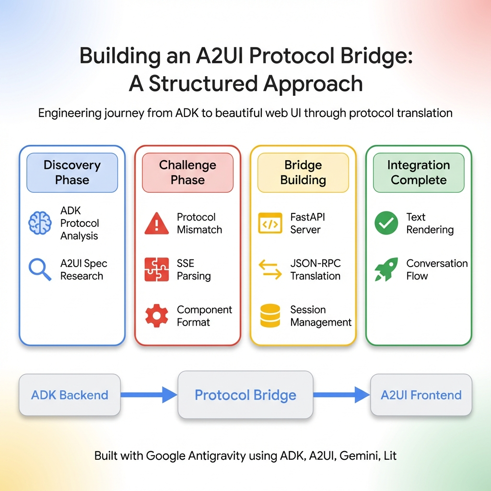

<p align="center">
  
</p>

<h1 align="center">🎯 AI Technical Interviewer</h1>

<p align="center">
  <strong>Powered by Google Agent Development Kit (ADK) & Gemini</strong>
</p>

<p align="center">
  <a href="https://google.github.io/adk-docs/"></a>
  <a href="https://ai.google.dev/"></a>
  <a href="https://github.com/google/A2UI"></a>
  <a href="https://cloud.google.com/run"></a>
</p>

<p align="center">
  <a href="#-features">Features</a> •
  <a href="#-quick-start">Quick Start</a> •
  <a href="#️-architecture">Architecture</a> •
  <a href="#️-deployment">Deploy</a> •
  <a href="#-contributing">Contributing</a>
</p>

---

> **v4.7.0 - A2UI Web Interface (Experimental)** Beautiful, component-based web UI via A2A-ADK bridge. Includes Sequential Safety, guided learning, and multi-dimensional scoring. Powered by Google's Agent Development Kit, Gemini, and [A2UI](https://github.com/google/A2UI). See [A2UI Integration Journey](docs/A2UI_INTEGRATION_JOURNEY.md).

---

## ✨ Features

### Core Capabilities
| Feature | Description |
|---------|-------------|
| 🎓 **Guided Learning Mode** | Study CS concepts with Socratic method & progressive hints |
| 🎯 **Multi-Agent Scoring** | Parallel evaluation: technical, communication, problem-solving |
| 🎚️ **Difficulty Modes** | Quick Screen (15min), Standard (45min), Deep Technical (90min) |
| 💬 **Answer Critique** | Get improvement suggestions & validation feedback |
| 🧠 **Adaptive Questions** | Dynamic difficulty based on performance |
| 💻 **Code Analysis** | Review and analyze Python code logic |
| 🛡️ **Safety Screening** | Content moderation & bias detection |
| ⚡ **Sequential Safety** | Automated risk assessment blocks dangerous code (v4.6.0) |
| 🌐 **A2UI Web Interface** | Beautiful Lit-based web UI with A2A-ADK bridge (v4.7.0 Experimental) |
| 📎 **Resume Support** | Paste resume text for analysis (file upload limited by Gemini) |

### Technical
| Feature | Description |
|---------|-------------|
| 🌐 **ADK Web UI** | Beautiful interface out of the box |
| ☁️ **Cloud Ready** | One-click deploy to GCP Cloud Run (Free Tier) |
| 📊 **Session State** | Persistent interview sessions |
| 🔄 **Multi-Agent** | 6 specialized sub-agents with orchestration |
| 📋 **Context Files** | Conductor-style config (.adk/) for team alignment (v4.6.0) |

---

## 🚀 Quick Start

### Prerequisites
- Python 3.11+
- [Google AI Studio API Key](https://aistudio.google.com/app/apikey) (Free)

### Installation

```bash
# Clone
git clone https://github.com/VIKAS9793/ai-interviewer-google-adk.git
cd ai-interviewer-google-adk
git checkout google-adk

# Setup
python -m venv .venv
.venv\Scripts\activate  # Windows | source .venv/bin/activate # Linux/Mac
pip install -r requirements.txt

# Configure
cp .env.example .env
# Add your GOOGLE_API_KEY to .env

# Run
adk web src
```

Open [http://127.0.0.1:8000](http://127.0.0.1:8000) 🚀

### A2UI Web Interface (Experimental)

```bash
# Terminal 1 - ADK Backend
adk web ./src

# Terminal 2 - A2A Bridge
python -m src.adk_interviewer.a2ui.bridge

# Terminal 3 - A2UI Frontend
cd a2ui-repo/samples/client/lit/shell && npm run dev
```

Open [http://localhost:3000/?app=interviewer](http://localhost:3000/?app=interviewer) 🎨

---

## 🏗️ Architecture

### A2UI Integration Journey



### System Architecture

```
┌─────────────────────────────────────────────────────────────────────┐
│                    A2UI Frontend (Experimental)                     │
│  ┌─────────────────┐           ┌────────────────────────────────┐  │
│  │   Lit Renderer  │──────────▶│  A2A-ADK Bridge (:10002)       │  │
│  │   :3000         │   A2A     │  FastAPI · JSON-RPC Translator │  │
│  └─────────────────┘           └────────────────────────────────┘  │
└──────────────────────────────────────────┬──────────────────────────┘
                                           │
                                           ▼
┌─────────────────────────────────────────────────────────────────────┐
│                      ADK Backend (:8000)                            │
│  ┌─────────────┐  ┌──────────────────┐  ┌─────────────────────┐    │
│  │   Web UI    │  │ Session Service  │  │  run_sse Endpoint   │    │
│  └─────────────┘  └──────────────────┘  └─────────────────────┘    │
└──────────────────────────────────────────┬──────────────────────────┘
                                           │
                                           ▼
                  ┌────────────────────────────────────────────┐
                  │      root_agent (Orchestrator)             │
                  │  Routes tasks to specialist sub-agents     │
                  └───────────────┬────────────────────────────┘
                                  │
            ┌─────────────────────┴─────────────────────┐
            │           6 Specialist Sub-Agents         │
            ├───────────────────────────────────────────┤
            │ • interviewer_agent (Questions/Eval)      │
            │ • resume_agent     (Resume/JD Analysis)   │
            │ • coding_agent     (Code + Safety v4.6)   │──▶ Gemini 2.5
            │ • safety_agent     (Content Moderation)   │
            │ • study_agent      (Guided Learning)      │
            │ • critic_agent     (Answer Critique)      │
            └───────────────────────────────────────────┘
```

### Tech Stack

| Layer | Technology |
|-------|------------|
| **Frontend (v4.7)** | [A2UI Lit Renderer](https://github.com/google/A2UI) |
| **Bridge (v4.7)** | FastAPI + httpx |
| **Framework** | [Google Agent Development Kit](https://google.github.io/adk-docs/) |
| **LLM** | [Gemini 2.5 Flash-Lite](https://ai.google.dev/) |
| **Web UI** | ADK Web (`adk web`) |
| **Deployment** | Google Cloud Run |
| **State** | ADK SessionService |

---

## 💡 Usage Examples

### Interview Mode
```
👤 "Start a system design interview"
🤖 Interviews you with adaptive questions
```

### Study Mode (v4.2)
```
👤 "Explain binary search trees"
🎓 In-depth concept explanation with examples

👤 "Give me a hint for two-sum problem"
🎓 Level 1: Gentle direction
🎓 Level 2: Algorithm suggestion  
🎓 Level 3: Detailed pseudocode
```

### Difficulty Modes (v4.4)
```
👤 "Quick screen for junior developer"
⚡ 15-min, 3-5 easy/medium questions

👤 "Standard technical interview"
🎯 45-min, comprehensive assessment

👤 "Deep technical for senior engineer"
🔬 90-min, expert-level questions
```

---

## ☁️ Deployment

### Google Cloud Run (Free Tier)

```bash
# Authenticate
gcloud auth login

# Deploy (one command!)
gcloud run deploy ai-interviewer \
  --source . \
  --region us-central1 \
  --allow-unauthenticated \
  --set-env-vars GOOGLE_API_KEY=your_key_here
```

**Free Tier:** 2M requests/month, 360,000 GB-seconds

See [docs/DEPLOYMENT.md](docs/DEPLOYMENT.md) for details.

---

## 📚 Documentation

### Core Docs
- [Architecture](docs/ARCHITECTURE.md)
- [Setup Guide](docs/SETUP.md)
- [Deployment](docs/DEPLOYMENT.md)
- [Changelog](docs/CHANGELOG.md)
- [Security](docs/SECURITY.md)
- [A2UI Integration Journey](docs/A2UI_INTEGRATION_JOURNEY.md) - Protocol bridge story

### Research & Planning
- [A2UI Analysis](docs/research/A2UI_ANALYSIS.md) - Google's agent UI protocol
- [A2UI Value Impact](docs/research/A2UI_VALUE_IMPACT.md) - ROI assessment
- [Kaggle Insights](docs/research/KAGGLE_INSIGHTS_V4.6.md) - v4.6.0 inspiration

### Architecture Decisions
- [ADR-001: Migration to ADK](docs/ADR/001-migration-to-google-adk.md)

---

## 🤝 Contributing

Contributions welcome! See [CONTRIBUTING.md](docs/CONTRIBUTING.md).

---

## � License

MIT License - see [LICENSE](LICENSE)

---

## 🙏 Acknowledgments

- Google ADK Team for the amazing framework
- Google A2UI Team for agent-to-user interface protocol
- Gemini AI for powering intelligence
- Built with Google Antigravity
- Open source community for inspiration

---

<p align="center">
  <strong>Built with ❤️ using Google's Agent Development Kit</strong>
</p>

<p align="center">
  <a href="https://github.com/VIKAS9793/ai-interviewer-google-adk">⭐ Star on GitHub</a>
</p>