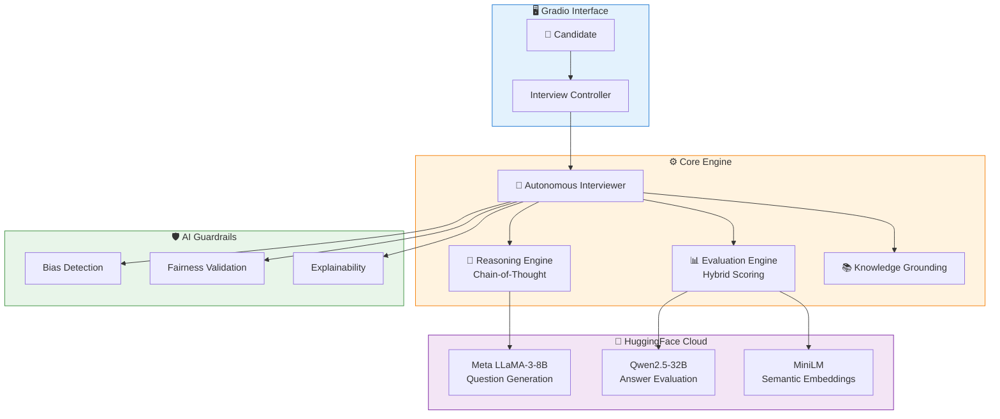
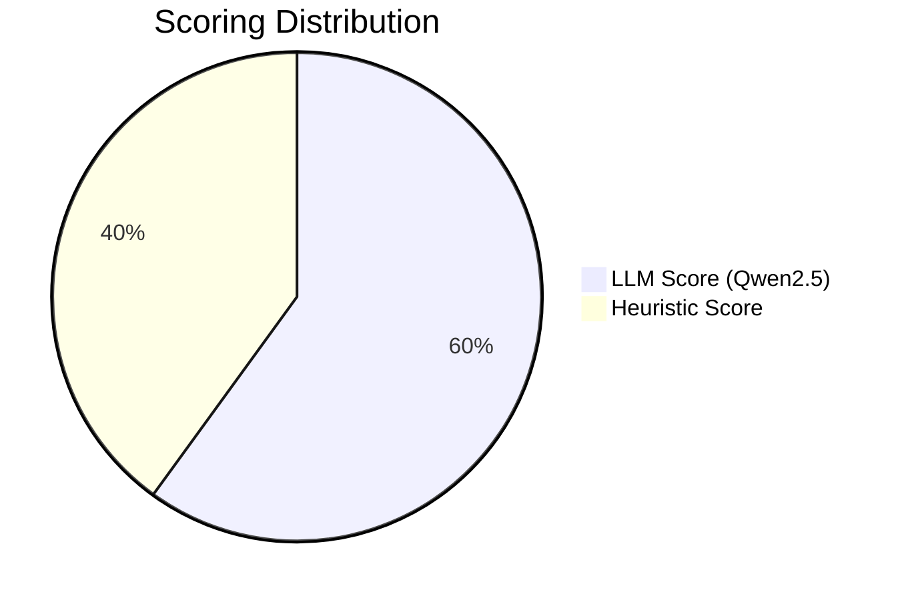

<div align="center">

# 🤖 Autonomous AI Technical Interviewer

### *Your AI-Powered Interview Coach with Human-Like Intelligence*

[](https://huggingface.co/spaces/Vikas9793/ai-interviewer)
[](https://github.com/VIKAS9793/ai-interviewer-langchain)
[](LICENSE)


**Self-Thinking AI** • **Chain-of-Thought** • **Hybrid Evaluation** • **Responsible AI**

</div>

---

## ✨ Features at a Glance

<table>
<tr>
<td width="50%">

### 🧠 Intelligent Reasoning
- Chain-of-Thought before every action
- Self-reflection and improvement
- Adaptive difficulty adjustment

</td>
<td width="50%">

### 📊 Hybrid Evaluation
- Dual-model scoring (LLaMA + Qwen2.5)
- Prometheus-style 1-5 rubric
- Semantic relevance checking

</td>
</tr>
<tr>
<td width="50%">

### 🛡️ Responsible AI
- Bias detection & mitigation
- Fairness validation
- Transparent decision-making

</td>
<td width="50%">

### ⚡ Cloud-Native
- HuggingFace Spaces ready
- No GPU required
- Instant deployment

</td>
</tr>
</table>

---

## 🏗️ System Architecture



---

## 📊 Evaluation System



| Score | Level | Criteria |
|:-----:|:------|:---------|
| ⭐⭐⭐⭐⭐ | **Exceptional** | Comprehensive, accurate, well-structured with examples |
| ⭐⭐⭐⭐ | **Good** | Covers main concepts correctly |
| ⭐⭐⭐ | **Adequate** | Addresses question but lacks depth |
| ⭐⭐ | **Limited** | Partially relevant, gaps/errors |
| ⭐ | **Poor** | Off-topic or incorrect |

---

## 🚀 Quick Start

### ☁️ Live Demo (Recommended)

<div align="center">

[](https://huggingface.co/spaces/Vikas9793/ai-interviewer)

</div>

### 💻 Local Installation
```bash
# Clone & Setup
git clone https://github.com/VIKAS9793/ai-interviewer-langchain.git
cd ai-interviewer-langchain
pip install -r requirements.txt

# Configure & Run
export HF_TOKEN="your_token"
python main.py
```

---

## 📚 Interview Topics

| Topic | Icon |
|-------|------|
| JavaScript/Frontend | � |
| Python/Backend | 🐍 |
| Machine Learning/AI | 🤖 |
| System Design | 🏗️ |
| Data Structures & Algorithms | 📈 |

---

## 📖 Documentation

| Document | Description |
|----------|-------------|
| 📋 [Setup Guide](docs/SETUP.md) | Installation & configuration |
| 🏗️ [Architecture](docs/ARCHITECTURE.md) | System design & diagrams |
| 📝 [ADR](docs/ADR.md) | Architectural decisions |
| 🗺️ [Roadmap](docs/ROADMAP.md) | Future plans |
| 🔧 [Troubleshooting](docs/TROUBLESHOOTING.md) | Common issues |
| 📜 [Changelog](CHANGELOG.md) | Version history |
| 🤝 [Contributing](CONTRIBUTING.md) | Contribution guide |

---

## 📈 Version History

| Version | Date | Highlights |
|---------|------|------------|
| **v2.2.2** | 2025-12-08 | Codebase cleanup, cloud-first |
| **v2.2.1** | 2025-12-08 | Hybrid evaluation, Prometheus rubrics |
| **v2.2.0** | 2025-12-08 | AI Internal Monologue, Semantic checking |
| **v2.1.0** | 2025-12-07 | HuggingFace Spaces deployment |
| **v2.0.0** | 2025-12-07 | Autonomous Agent architecture |

---

<div align="center">

### ⭐ Star this repo if you find it useful!

[](https://github.com/VIKAS9793/ai-interviewer-langchain)
[](https://github.com/VIKAS9793/ai-interviewer-langchain/fork)

---

**Built with ❤️ using LangChain, HuggingFace, and Gradio**

[](LICENSE)

</div>