<p align="center">
  
</p>

<h1 align="center">🎯 AI Technical Interviewer</h1>

<p align="center">
  <strong>Powered by Google Agent Development Kit (ADK) & Gemini</strong>
</p>

<p align="center">
  <a href="https://google.github.io/adk-docs/"></a>
  <a href="https://ai.google.dev/"></a>
  <a href="https://cloud.google.com/run"></a>
</p>

<p align="center">
  <a href="#✨-features">Features</a> •
  <a href="#🚀-quick-start">Quick Start</a> •
  <a href="#🏗️-architecture">Architecture</a> •
  <a href="#☁️-deployment">Deploy</a> •
  <a href="#🤝-contributing">Contributing</a>
</p>

---

> **An AI-powered technical interview assistant that conducts adaptive, fair, and insightful mock interviews.** Using Google's Agent Development Kit and Gemini AI, it generates contextual questions, evaluates responses in real-time, and provides actionable feedback to help candidates improve their skills.

---

## ✨ Features

| Feature | Description |
|---------|-------------|
| 🧠 **Adaptive Interviews** | Questions adjust difficulty based on your responses |
| 💬 **Natural Conversation** | Powered by Gemini 2.5 Flash for human-like dialogue |
| 📊 **Real-time Evaluation** | Instant feedback with Chain-of-Thought reasoning |
| 🛡️ **Built-in Safety** | Google's native content filtering & guardrails |
| 🌐 **Web Interface** | Beautiful ADK Web UI out of the box |
| ☁️ **Cloud Ready** | One-click deploy to GCP Cloud Run (Free Tier) |

---

## 🚀 Quick Start

### Prerequisites
- Python 3.11+
- [Google AI Studio API Key](https://aistudio.google.com/app/apikey) (Free)

### Installation

```bash
# Clone the repository
git clone https://github.com/VIKAS9793/ai-interviewer-langchain.git
cd ai-interviewer-langchain
git checkout google-adk

# Create virtual environment
python -m venv .venv
.venv\Scripts\activate  # Windows
# source .venv/bin/activate  # macOS/Linux

# Install dependencies
pip install -r requirements.txt

# Set your API key
cp .env.example .env
# Edit .env and add your GOOGLE_API_KEY
```

### Run Locally

```bash
adk web src
```

Open [http://127.0.0.1:8000](http://127.0.0.1:8000) and start interviewing!

---

## 🏗️ Architecture

```mermaid
flowchart LR
    subgraph "Client"
        A[👤 Candidate]
    end
    
    subgraph "ADK Web Server"
        B[ADK Web UI]
        C[Session Service]
    end
    
    subgraph "Agent Layer"
        D[🤖 Interviewer Agent]
        E[Gemini 2.5 Flash-Lite]
    end
    
    A --> B --> C --> D --> E
    E --> D --> C --> B --> A
```



### Tech Stack

| Layer | Technology |
|-------|------------|
| **Framework** | [Google Agent Development Kit (ADK)](https://google.github.io/adk-docs/) |
| **LLM** | [Gemini 2.5 Flash-Lite](https://ai.google.dev/) |
| **Web UI** | ADK Web (`adk web`) |
| **Deployment** | Google Cloud Run |
| **State** | ADK SessionService |

---

## ☁️ Deployment

### Google Cloud Run (Free Tier)

```bash
# Authenticate with GCP
gcloud auth login

# Deploy
gcloud run deploy ai-interviewer \
  --source . \
  --region us-central1 \
  --allow-unauthenticated \
  --set-secrets "GOOGLE_API_KEY=google-api-key:latest"
```

See [docs/DEPLOYMENT.md](docs/DEPLOYMENT.md) for detailed instructions.

---

## 📚 Documentation

| Document | Description |
|----------|-------------|
| [📋 SETUP.md](docs/SETUP.md) | Detailed setup instructions |
| [🏗️ ARCHITECTURE.md](docs/ARCHITECTURE.md) | System design & components |
| [☁️ DEPLOYMENT.md](docs/DEPLOYMENT.md) | Cloud Run deployment guide |
| [🔄 ADR-001](docs/ADR/001-migration-to-google-adk.md) | Why we chose Google ADK |

---

## 🤝 Contributing

We welcome contributions! Please see [docs/CONTRIBUTING.md](docs/CONTRIBUTING.md) for guidelines.

1. Fork the repository
2. Create a feature branch (`git checkout -b feature/amazing-feature`)
3. Commit your changes (`git commit -m 'Add amazing feature'`)
4. Push to the branch (`git push origin feature/amazing-feature`)
5. Open a Pull Request

---

## 📜 License

This project is licensed under the **Apache License 2.0** - see [LICENSE](LICENSE) for details.

---

## 🙏 Credits & Acknowledgments

<table>
  <tr>
    <td align="center">
      <a href="https://google.github.io/adk-docs/">
        <br/>
        <strong>Google ADK</strong>
      </a><br/>
      Agent Development Kit
    </td>
    <td align="center">
      <a href="https://ai.google.dev/">
        <br/>
        <strong>Gemini</strong>
      </a><br/>
      Large Language Model
    </td>
    <td align="center">
      <a href="https://cloud.google.com/">
        <br/>
        <strong>Google Cloud</strong>
      </a><br/>
      Cloud Infrastructure
    </td>
  </tr>
</table>

---

## ⚠️ Migration Notice

> **This is the new Google ADK version.** The previous HuggingFace/LangGraph version has been deprecated.
> 
> See [docs/ADR/001-migration-to-google-adk.md](docs/ADR/001-migration-to-google-adk.md) for migration details.

---

<p align="center">
  Made with ❤️ using Google ADK<br/>
  <sub>© 2025 AI Interviewer Project • Created by <a href="https://github.com/VIKAS9793">Vikas</a></sub>
</p>