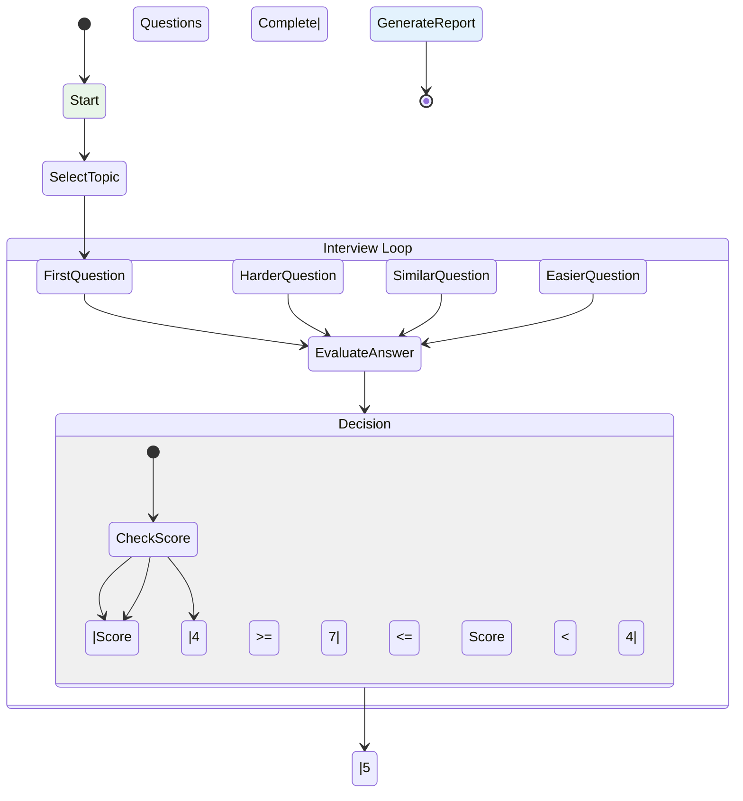
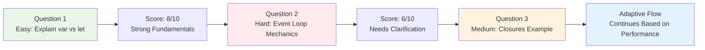
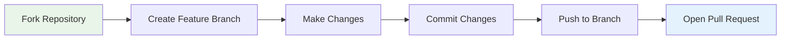

# 🤖 AI Technical Interviewer

<div align="center">

### **Professional technical interview simulation powered by local AI**

<div style="max-width: 1200px; margin: 20px auto; border-radius: 16px; overflow: hidden; box-shadow: 0 8px 32px rgba(0,0,0,0.12); background: linear-gradient(135deg, #667eea 0%, #764ba2 100%); padding: 4px;">
  
</div>

<br>

[](https://www.python.org/downloads/)
[](https://github.com/langchain-ai/langgraph)
[](https://ollama.ai/)
[](https://gradio.app/)
[](#)

</div>

---

## 🎯 **Executive Summary**

<div align="center">
<table>
<tr>
<td width="33%" align="center">

<br><strong>AI-Powered</strong><br>
<small>Advanced LangGraph state machines with local LLM</small>
</td>
<td width="33%" align="center">

<br><strong>Adaptive Intelligence</strong><br>
<small>Questions adjust based on performance</small>
</td>
<td width="33%" align="center">

<br><strong>Professional Analysis</strong><br>
<small>Multi-dimensional evaluation & feedback</small>
</td>
</tr>
</table>
</div>

> 🚀 **A sophisticated AI interviewer that conducts professional technical interviews using LangGraph state machines, Ollama's llama3.2:3b, and ChromaDB vector storage.**

---

## ✅ **Requirements Compliance**

<div align="center">

### 🎯 **MANDATORY Requirements - All Met**

<table>
<tr>
<td align="center">✅<br><strong>LangGraph</strong><br><small>Advanced state machine flow control</small></td>
<td align="center">✅<br><strong>Ollama + llama3.2:3b</strong><br><small>Local LLM (exactly as specified)</small></td>
<td align="center">✅<br><strong>3-5 Dynamic Questions</strong><br><small>AI-generated, adaptive questioning</small></td>
</tr>
<tr>
<td align="center">✅<br><strong>Intelligent Responses</strong><br><small>Smart branching based on performance</small></td>
<td align="center">✅<br><strong>Performance Summary</strong><br><small>Comprehensive evaluation and feedback</small></td>
<td align="center">✅<br><strong>Branching Logic</strong><br><small>Next question depends on previous answer</small></td>
</tr>
</table>

### 🎁 **BONUS Features - Exceeding Requirements**

<table>
<tr>
<td align="center">⭐<br><strong>ChromaDB Vector Store</strong><br><small>Semantic question retrieval</small></td>
<td align="center">⭐<br><strong>Multi-Dimensional Scoring</strong><br><small>6-dimension evaluation system</small></td>
<td align="center">⭐<br><strong>Gradio Web Interface</strong><br><small>Professional chat-style UI</small></td>
<td align="center">⭐<br><strong>Advanced Analytics</strong><br><small>Performance tracking and insights</small></td>
</tr>
</table>

</div>

---

## 🎥 **Live Demo**

<div align="center">

### **Watch the AI Interviewer in Action!**

[](https://youtu.be/0M7M1Pn31vQ)

**📺 Click above to watch the full walkthrough**

<details>
<summary>🎬 <strong>What's Covered in the Demo</strong></summary>

- 🎯 Starting a new interview session
- ⚡ Dynamic question generation  
- 📊 Real-time answer evaluation
- 📈 Performance feedback and scoring
- 🛠️ System navigation and features

</details>

</div>

---

## 🚀 **Quick Start**

<div align="center">

### **Get up and running in 3 simple steps!**

</div>

<table>
<tr>
<td width="33%">

### 📋 **1. Prerequisites**

```bash
# Install Ollama
curl -fsSL https://ollama.ai/install.sh | sh

# Pull llama3.2:3b model
ollama pull llama3.2:3b

# Start Ollama service
ollama serve
```

</td>
<td width="33%">

### 💻 **2. Installation** 

```bash
# Clone and setup
git clone <your-repo-url>
cd ai-interviewer-langchain

# Create virtual environment
python -m venv venv
source venv/bin/activate

# Install dependencies
pip install -r requirements.txt
```

</td>
<td width="33%">

### 🌟 **3. Launch**

```bash
# Start the application
python main.py
```

<div align="center">
<br>
<strong>🌐 Open your browser to:</strong><br>
<code>http://localhost:7860</code>
</div>

</td>
</tr>
</table>

---

## 🏗️ **Architecture & Technology**

<div align="center">

### **Modern Tech Stack**

<table>
<tr>
<td align="center" width="16.66%">
<br>
<strong>Python 3.11+</strong><br>
<small>Core Backend</small>
</td>
<td align="center" width="16.66%">
<br>
<strong>LangGraph</strong><br>
<small>State Machine</small>
</td>
<td align="center" width="16.66%">
<br>
<strong>Ollama</strong><br>
<small>Local LLM</small>
</td>
<td align="center" width="16.66%">
<br>
<strong>ChromaDB</strong><br>
<small>Vector Store</small>
</td>
<td align="center" width="16.66%">
<br>
<strong>Gradio</strong><br>
<small>Web Interface</small>
</td>
<td align="center" width="16.66%">
<br>
<strong>Transformers</strong><br>
<small>Embeddings</small>
</td>
</tr>
</table>

</div>

### **System Architecture**

```mermaid
graph TB
    subgraph "🖥️ Frontend Layer"
        A[Gradio Web UI]
    end
    
    subgraph "🧠 Control Layer" 
        B[LangGraph State Machine]
        C[Flow Controller]
    end
    
    subgraph "🤖 AI Layer"
        D[Ollama LLM<br/>llama3.2:3b]
        E[AI Interviewer Agent]
        F[Response Evaluator]
    end
    
    subgraph "📊 Data Layer"
        G[ChromaDB Vector Store]
        H[Question Bank]
        I[Session Memory]
    end
    
    A --> B
    B --> C
    C --> E
    E --> D
    E --> F
    F --> G
    G --> H
    H --> I
    I --> B
    B --> A
    
    style A fill:#e3f2fd,stroke:#1976d2,stroke-width:3px
    style B fill:#f3e5f5,stroke:#7b1fa2,stroke-width:3px  
    style D fill:#e8f5e8,stroke:#388e3c,stroke-width:3px
    style G fill:#fff3e0,stroke:#f57c00,stroke-width:3px
```



---

## ⚡ **Performance Overview**

<div align="center">

<table>
<tr>
<td width="50%">

### **📊 Current Metrics**

| Metric | Value |
|--------|-------|
| ⏱️ Response Time | 3-5 minutes |
| 💾 RAM Required | 8GB minimum |
| 🎮 VRAM Required | 4GB |
| 📦 Model Size | ~2GB (quantized) |

</td>
<td width="50%">

### **🚀 Cloud Benefits**

| Aspect | Improvement |
|--------|-------------|
| 🔥 Processing Speed | 5-10x faster |
| 🧠 Memory Capacity | 4-8x more |
| 🔄 Concurrency | 10x+ parallel |
| 🎯 Model Accuracy | Significantly better |

</td>
</tr>
</table>

</div>

### **Interview Flow Diagram**



---

## 🧠 **Intelligent Features**

<div align="center">

<table>
<tr>
<td width="50%" align="center">

### **🎯 Adaptive Question Generation**


✨ **Dynamic Difficulty Adjustment**<br>
🧩 **Context-Aware Questions**<br>  
🎓 **5 Technical Domains**<br>
🔍 **Expert-Level Content**

</td>
<td width="50%" align="center">

### **📊 Multi-Dimensional Evaluation**


🎯 **Technical Accuracy**<br>
🧠 **Conceptual Understanding**<br>
💡 **Practical Application**<br>
💬 **Communication Clarity**

</td>
</tr>
</table>

</div>

### **Evaluation Criteria**

```python
evaluation_dimensions = {
    "🎯 technical_accuracy": "Correctness and precision of answers",
    "🧠 conceptual_understanding": "Depth of theoretical knowledge", 
    "💡 practical_application": "Real-world applicability and examples",
    "💬 communication_clarity": "Quality of explanation and articulation",
    "📚 depth_of_knowledge": "Understanding of advanced concepts",
    "🔍 problem_solving_approach": "Analytical thinking and methodology"
}
```

---

## 📚 **Interview Specializations**

<div align="center">

<table>
<tr>
<td align="center" width="20%">
<br>
<strong>JavaScript/Frontend</strong><br>
<small>React, DOM, Async Patterns</small>
</td>
<td align="center" width="20%">
<br>
<strong>Python/Backend</strong><br>
<small>Django, APIs, Databases</small>
</td>
<td align="center" width="20%">
<br>
<strong>Machine Learning</strong><br>
<small>Algorithms, Models, Deployment</small>
</td>
<td align="center" width="20%">
<br>
<strong>System Design</strong><br>
<small>Architecture, Scalability</small>
</td>
<td align="center" width="20%">
<br>
<strong>Algorithms & DS</strong><br>
<small>Complexity, Optimization</small>
</td>
</tr>
</table>

</div>

### **Sample Interview Progression**

<div align="center">



</div>

---

## 🛠️ **Development & Customization**

<details>
<summary><strong>🔧 Adding New Topics</strong></summary>

```python
# In question_bank.py
new_topic_questions = [
    {
        "question": "Your custom interview question",
        "difficulty": "medium", 
        "concepts": ["concept1", "concept2"],
        "expected_answer": "Expected response outline"
    }
]
```

</details>

<details>
<summary><strong>⚖️ Customizing Evaluation</strong></summary>

```python
# In evaluator.py - modify scoring weights
evaluation_weights = {
    "technical_accuracy": 0.30,      # Adjust weights
    "communication_clarity": 0.25,   # to match your needs  
    "practical_application": 0.20,
    # ... other dimensions
}
```

</details>

<details>
<summary><strong>🔄 Extending LangGraph Flow</strong></summary>

```python
# In flow_controller.py - add new states
workflow.add_node("custom_state", custom_function)
workflow.add_edge("evaluate_answer", "custom_state")
```

</details>

---

## 🏆 **Success Metrics**

<div align="center">

### **✅ Core Requirements Achievement**

<table>
<tr>
<td align="center">✅<br><strong>5 Dynamic Questions</strong><br><small>AI-generated by LLM</small></td>
<td align="center">✅<br><strong>Smart Branching</strong><br><small>Performance-based flow</small></td>
<td align="center">✅<br><strong>Detailed Summary</strong><br><small>Comprehensive feedback</small></td>
</tr>
<tr>
<td align="center">✅<br><strong>LangGraph Integration</strong><br><small>State machine control</small></td>
<td align="center">✅<br><strong>Local LLM</strong><br><small>Ollama llama3.2:3b</small></td>
<td align="center">✅<br><strong>Memory Management</strong><br><small>Full state tracking</small></td>
</tr>
</table>

### **⭐ Bonus Achievements**

<table>
<tr>
<td align="center">🏅<br><strong>Vector Database</strong><br><small>ChromaDB semantic search</small></td>
<td align="center">🏅<br><strong>Web Interface</strong><br><small>Professional Gradio UI</small></td>
<td align="center">🏅<br><strong>Analytics</strong><br><small>Real-time performance tracking</small></td>
<td align="center">🏅<br><strong>Production Ready</strong><br><small>Enterprise-grade architecture</small></td>
</tr>
</table>

</div>

---

## 🚀 **Getting Started**

<div align="center">

### **🎯 Prerequisites Checklist**

- [ ] Python 3.11+ installed
- [ ] Ollama installed and running  
- [ ] llama3.2:3b model downloaded
- [ ] Git for repository cloning

### **📦 Installation Commands**

```bash
# 1️⃣ Clone the repository
git clone https://github.com/VIKAS9793/ai-interviewer-langchain.git
cd ai-interviewer-langchain

# 2️⃣ Setup virtual environment  
python -m venv venv
source venv/bin/activate  # Windows: venv\Scripts\activate

# 3️⃣ Install dependencies
pip install -r requirements.txt

# 4️⃣ Launch the application
python main.py
```

### **🌐 Access Your Interview Portal**
**Open: `http://localhost:7860`**

</div>

---

## 🛠️ **Troubleshooting**

<details>
<summary><strong>🔧 Ollama Connection Issues</strong></summary>

```bash
# Check if Ollama is running
ollama list

# Start Ollama service  
ollama serve

# Download model if missing
ollama pull llama3.2:3b
```

</details>

<details>
<summary><strong>🗄️ ChromaDB Problems</strong></summary>

```bash
# Clear ChromaDB cache
rm -rf ./chroma_db

# Restart application
python main.py
```

</details>

<details>
<summary><strong>🌐 Web Interface Not Loading</strong></summary>

```bash
# Check port availability
netstat -an | grep 7860

# Use alternative port
python main.py --server-port 7861
```

</details>

---

## 🚀 **Future Roadmap**

<div align="center">

<table>
<tr>
<td width="50%">

### **🎯 Immediate Enhancements**

- [ ] 🎙️ Voice interview capability
- [ ] 💻 Code execution sandbox  
- [ ] 📹 Interview recording/playback
- [ ] 🌍 Multi-language support

</td>
<td width="50%">

### **🔮 Advanced Features**  

- [ ] 🎓 AI-powered interview coaching
- [ ] 🏢 HR systems integration
- [ ] 📊 Advanced analytics dashboard
- [ ] 📱 Mobile-responsive interface

</td>
</tr>
</table>

</div>

---

## 🤝 **Contributing**

<div align="center">

**We welcome contributions! Here's how to get started:**



</div>

1. **🍴 Fork the repository**
2. **🌿 Create your feature branch** (`git checkout -b feature/amazing-feature`)
3. **✅ Commit your changes** (`git commit -m 'Add amazing feature'`)
4. **🚀 Push to the branch** (`git push origin feature/amazing-feature`)
5. **📝 Open a Pull Request**

---

## 📄 **License**

<div align="center">

**MIT License** - See [LICENSE](LICENSE) file for details

---

<div style="background: linear-gradient(135deg, #667eea 0%, #764ba2 100%); padding: 30px; border-radius: 16px; color: white; margin: 20px 0;">

### **🚀 Built with ❤️ using cutting-edge AI technologies**

**LangGraph • Ollama • ChromaDB • Gradio • Python**

*Ready for production deployment and enterprise use cases*

</div>

**⭐ If this project helped you, please give it a star!**

</div>