# 🤖 Autonomous AI Technical Interviewer

### **Self-Thinking, Responsible AI Interview System (v2.0)**

  

 

> 🚀 **A self-thinking AI interviewer with Chain-of-Thought reasoning, responsible AI guardrails, and persistent memory. Built with Ollama for complete offline privacy.**

---

## 📚 Documentation

| Document | Description |
|----------|-------------|
| **[🚀 Setup Guide](docs/SETUP.md)** | Prerequisites, Installation, and Running the app. |
| **[🏗️ Architecture](docs/ARCHITECTURE.md)** | Deep dive into the Hybrid Agentic Architecture (ReasoningBank, ReflectAgent). |
| **[🧠 ADRs](docs/ADR.md)** | Architectural Decision Records explaining *why* we built it this way. |
| **[🔧 Troubleshooting](docs/TROUBLESHOOTING.md)** | Solutions for common Ollama and connection issues. |
| **[🛣️ Roadmap](docs/ROADMAP.md)** | Future plans including Voice Mode and Code Sandbox. |
| **[📝 Changelog](CHANGELOG.md)** | History of changes (Latest: v2.0 - Hybrid Architecture). |

---

## ⚡ Key Features (v2.0)

*   **Autonomy:** Uses Chain-of-Thought (CoT) to "think" before every question/evaluation.
*   **Persistent Memory:** "Remembers" successful strategies using **ReasoningBank** (SQLite).
*   **Self-Correction:** **ReflectAgent** reviews questions for bias before they are asked.
*   **Human-Like:** Adapts tone and difficulty based on candidate stress levels (`metacognitive.py`).
*   **Local Privacy:** Runs 100% offline with **Ollama (`llama3.2:3b`)**.

---

## 🎥 Quick Look

```mermaid
graph LR
    A[👤 Start] --> B{🧠 Reasoning Engine}
    B -->|Retrieve Strategy| C[(📚 Memory Bank)]
    B -->|Draft Question| D[📝 Draft]
    D -->|Safety Check| E[🛡️ Reflect Agent]
    E -->|Approved| F[🗣️ Ask Candidate]
    F -->|Answer| G[📊 Evaluate]
    G -->|Update Memory| C
```

---

## 🤝 Contributing

We welcome contributions! Please see [CONTRIBUTING.md](CONTRIBUTING.md) for details on how to get started.

## 📄 License

This project is licensed under the MIT License - see the [LICENSE](LICENSE) file for details.