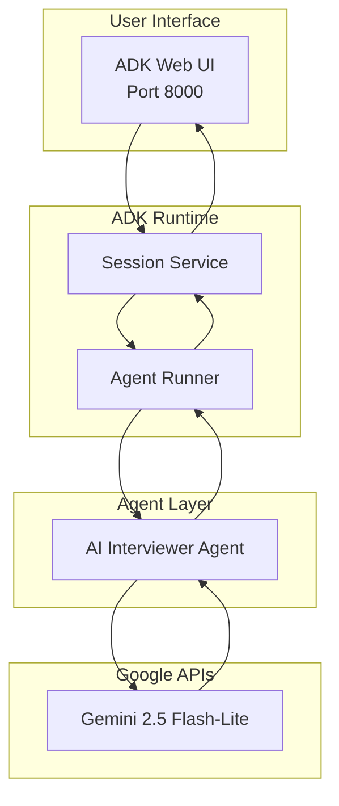
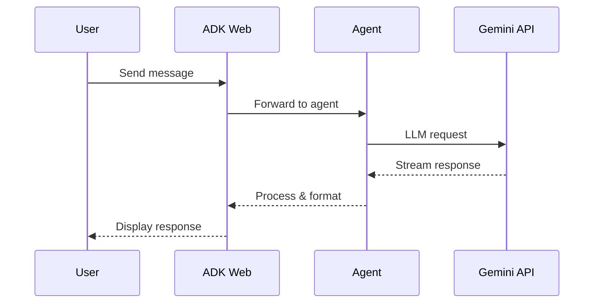

# Architecture

> System design and components of the AI Technical Interviewer

---

## Overview



---

## Components

### 1. ADK Web Server
- Built-in web interface from Google ADK
- Session management and state persistence
- Real-time streaming responses

### 2. Interviewer Agent
- Main LLM-powered agent
- Generates adaptive questions
- Evaluates answers with CoT reasoning
- Provides constructive feedback

### 3. Gemini Integration
- Native API calls (no wrapper)
- Model: `gemini-2.5-flash-lite`
- Streaming responses enabled

---

## Data Flow



---

## Directory Structure

```
src/
└── adk_interviewer/
    ├── agent.py          # Main agent definition
    ├── __init__.py       # Package init
    ├── config/           # Configuration
    ├── tools/            # Optional tools
    ├── agents/           # Sub-agents (future)
    ├── workflows/        # Multi-agent flows
    └── utils/            # Helpers
```

---

## Key Design Decisions

1. **Single Agent:** Simple, focused interviewer agent
2. **No Custom UI:** Leverage ADK's built-in web interface
3. **Stateless Tools:** Functions, not classes
4. **Native Gemini:** Direct API calls for performance

---

## Security

- API keys in environment variables
- Google's native content filtering
- No PII storage in sessions
- HTTPS in production (Cloud Run)

---

## See Also

- [Setup Guide](SETUP.md)
- [Deployment Guide](DEPLOYMENT.md)
- [ADR-001: Migration to ADK](ADR/001-migration-to-google-adk.md)
