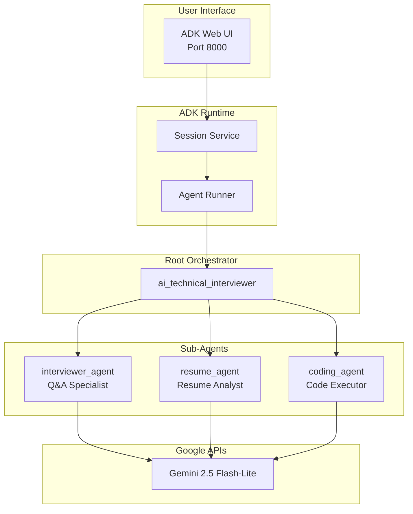
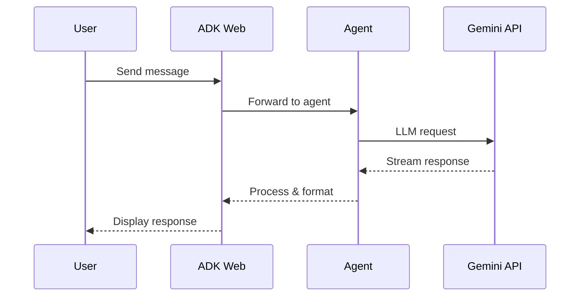

# Architecture

> System design and components of the AI Technical Interviewer (v4.1)

---

## Overview - Multi-Agent Architecture



---

## Components

### 1. ADK Web Server
- Built-in web interface from Google ADK
- Session management and state persistence
- Real-time streaming responses

### 2. Root Agent (Orchestrator)
- **Entry Point:** `src/adk_interviewer/agent.py`
- Coordinates all specialist sub-agents
- Routes messages to appropriate specialists
- Synthesizes responses into coherent conversation

### 3. Sub-Agents

#### Interviewer Agent
- **Location:** `src/adk_interviewer/agents/interviewer_agent.py`
- **Tools:** `generate_question`, `evaluate_answer`
- **Purpose:** Generates adaptive questions and evaluates answers
- **Model:** Gemini 2.5 Flash-Lite

#### Resume Agent
- **Location:** `src/adk_interviewer/agents/resume_agent.py`
- **Tools:** `parse_resume`, `analyze_job_description`
- **Purpose:** Analyzes resumes and job requirements
- **Model:** Gemini 2.5 Flash-Lite

#### Coding Agent
- **Location:** `src/adk_interviewer/agents/coding_agent.py`
- **Executor:** `BuiltInCodeExecutor` (sandboxed Python)
- **Purpose:** Executes and verifies code solutions
- **Model:** Gemini 2.5 Flash-Lite

### 4. Gemini Integration
- Native API calls via Google AI Studio
- Model: `gemini-2.5-flash-lite`
- Streaming responses enabled


---

## Data Flow



---

## Directory Structure

```
src/
└── adk_interviewer/
    ├── agent.py          # Root orchestrator (canonical entry point)
    ├── main.py           # CLI/import validation
    ├── agents/           # Sub-agent factory functions
    │   ├── interviewer_agent.py  # Q&A specialist
    │   ├── resume_agent.py       # Resume/JD analyst
    │   ├── coding_agent.py       # Code executor
    │   ├── safety_agent.py       # Safety monitor (optional)
    │   └── critic_agent.py       # Answer critic (optional)
    ├── config/           # Configuration (ADKConfig)
    ├── tools/            # Custom ADK tools
    │   ├── question_generator.py
    │   ├── answer_evaluator.py
    │   ├── resume_parser.py
    │   └── jd_analyzer.py
    ├── tools/            # ADK-compliant tools (with ToolContext)
    ├── agents/           # Agent factories (critic, safety)
    ├── workflows/        # Multi-agent flows (SequentialAgent)
    └── utils/            # Reserved for future helpers
```

---

## Key Design Decisions

1. **Single Canonical Entry** - `agent.py` is the only `root_agent` definition
2. **ADK Best Practices** - Tools use `ToolContext` for state management
3. ** Built-in UI** - Leverage ADK's web interface (no custom UI)
4. **Stateful Tools** - Session state tracks questions, scores across turns
5. **Native Gemini** - Direct API calls for performance

---

## Security

- API keys in environment variables
- Google's native content filtering
- No PII storage in sessions
- HTTPS in production (Cloud Run)

---

## See Also

- [Setup Guide](SETUP.md)
- [Deployment Guide](DEPLOYMENT.md)
- [ADR-001: Migration to ADK](ADR/001-migration-to-google-adk.md)
