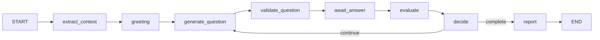

# 🤖 Autonomous AI Interviewer System

## Overview

An **Autonomous AI Technical Interviewer** with human-like capabilities, deployed on HuggingFace Spaces.

| Feature | Description |
|---------|-------------|
| **Self-Thinking** | Chain-of-Thought reasoning before every action |
| **Autonomous Evaluation** | Single-Model (LLaMA 3) with Prometheus-style rubrics |
| **Semantic Relevance** | Embedding-based answer relevance checking |
| **Knowledge Grounding** | Answer verification against authoritative sources |
| **AI Guardrails** | Fair, unbiased, explainable decisions |

## System Architecture

```mermaid
flowchart TD
    User([User]) <--> View[Gradio UI (src/ui)]
    View <--> Handler[InterviewHandlers]
    Handler <--> Ctrl[Controller (Logic)]
    
    subgraph "Core Engine (Orchestrator)"
        Ctrl --> AutoInt[AutonomousInterviewer]
    end
    
    subgraph "State Layer"
        SM[SessionManager]
        DB[(Session DB)]
        SM <--> DB
    end
    
    subgraph "Cognitive Services (Modules)"
        RAG[RAG Service]
        Critic[Critic Service]
        Learn[Learning Service]
        
        RAG <--> VDB[(Vector Store)]
        Learn <--> RB[(Reasoning Bank)]
    end
    
    AutoInt --> SM
    
    AutoInt -- "Context" --> RAG
    AutoInt -- "Draft" --> Critic
    AutoInt -- "Trajectory" --> Learn
```

## Quick Start
**Live Demo:** https://huggingface.co/spaces/Vikas9793/ai-interviewer

## Models Used

| Purpose | Model | Provider |
|---------|-------|----------|
| Questions | Meta-Llama-3-8B-Instruct | HuggingFace |
| Evaluation| Meta-Llama-3-8B-Instruct | HuggingFace |
| Embeddings | all-MiniLM-L6-v2 | Sentence Transformers |

## 📦 System Components (v3.0 Micro-Services)

### 1. Orchestration Layer (`AutonomousInterviewer`)
*   **Role:** The Central Executive / "Brain".
*   **Responsibility:** Coordinates the interview lifecycle but delegates all "thinking" and "remembering" to specialized modules.
*   **Key Behavior:** Stateless. It pulls state from `SessionManager` and pushes tasks to `CognitiveModules`.

### 2. State Layer (`SessionManager`)
*   **Role:** Single Source of Truth.
*   **Responsibility:** Manages `InterviewSession` data, including history, scores, and candidate profile.
*   **Concurrency:** Handles locking to prevent race conditions during async state updates.

### 3. Cognitive Services (`src/ai_interviewer/modules`)
The intelligence is composed of three specialized services:

*   **RAG Service (`rag_service.py`):**
    *   **Context Engineering:** Builds the exact prompt context for the LLM.
    *   **Knowledge Grounding:** Retrieves relevant technical documentation (Vector Store) to verify answers and prevent hallucinations.

*   **Critic Service (`critic_service.py`):**
    *   **Reflexion Loop:** "Thinks before speaking". Critiques generated questions for bias, clarity, and difficulty.
    *   **Quality Control:** If a question is poor, it rejects it and forces a regeneration.

*   **Learning Service (`learning_service.py`):**
    *   **Intrinsic Memory:** Stores "Winning Strategies" in the `ReasoningBank`.
    *   **Skill Graph:** Updates the system's understanding of what constitutes a "Good Interview" based on past successful sessions.

*   **JD Parser (`jd_parser.py`):** *(New in v3.1)*
    *   **URL Parsing:** Extracts role, company from Google Careers, LinkedIn, Lever, Greenhouse URLs.
    *   **Smart Role Parsing:** Separates "Product Manager YouTube Channel" into core role + area context.
    *   **Interview Context:** Returns topic for questions, role for greeting, area for context.

### 4. LangGraph Interview Flow *(New in v3.1)*



*   **State Schema:** `InterviewState` TypedDict with session, context, and performance tracking.
*   **Unified Flow:** Both Interview Tab and Practice Tab use the same graph.
*   **Critic Agent:** Question validation node (placeholder for v3.2 full implementation).

## ⚡ Performance

| Metric | Value |
|--------|-------|
| **Response Time** | 3-6 seconds (includes CoT & RAG) |
| **Accuracy** | >90% (with Critic validation) |
| **Context Window** | Dynamic (Managed by ContextEngineer) |
