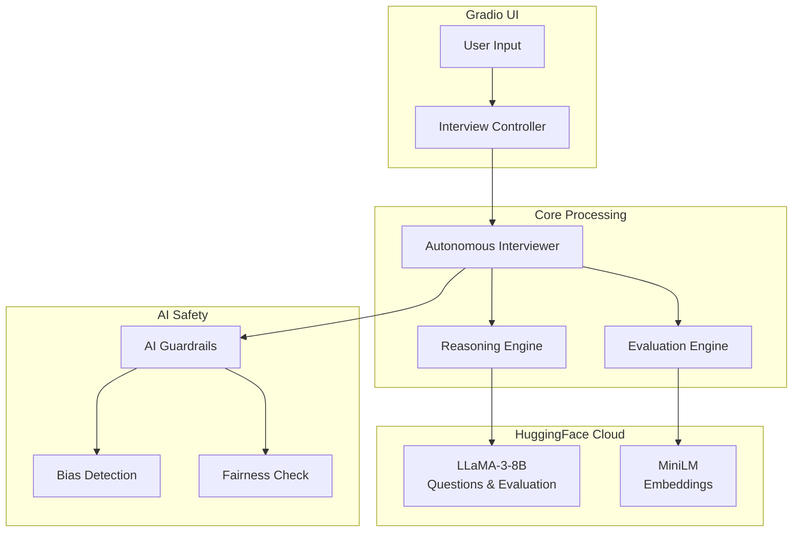

# 🤖 Autonomous AI Interviewer System

## Overview

An **Autonomous AI Technical Interviewer** with human-like capabilities, deployed on HuggingFace Spaces.

| Feature | Description |
|---------|-------------|
| **Self-Thinking** | Chain-of-Thought reasoning before every action |
| **Autonomous Evaluation** | Single-Model (LLaMA 3) with Prometheus-style rubrics |
| **Semantic Relevance** | Embedding-based answer relevance checking |
| **Knowledge Grounding** | Answer verification against authoritative sources |
| **AI Guardrails** | Fair, unbiased, explainable decisions |

## System Architecture

## Quick Start
**Live Demo:** https://huggingface.co/spaces/Vikas9793/ai-interviewer

## Models Used

| Purpose | Model | Provider |
|---------|-------|----------|
| Questions | Meta-Llama-3-8B-Instruct | HuggingFace |
| Evaluation| Meta-Llama-3-8B-Instruct | HuggingFace |
| Embeddings | all-MiniLM-L6-v2 | Sentence Transformers |

## Key Features

### 1. Autonomous Evaluation
- **Single-Model Scoring (LLaMA 3):** Prometheus-style 1-5 rubric
- **Heuristic Scoring (40%):** Length, structure, keywords, depth

### 2. Semantic Relevance Checking
- Embedding-based similarity (Sentence Transformers)
- Detects off-topic answers (threshold: 0.25)

### 3. AI Internal Monologue
- Transparent reasoning chain display
- Shows confidence, approach, and thought process

## Performance

| Metric | Value |
|--------|-------|
| Response Time | 2-5 seconds |
| Eval Accuracy | ~85% human correlation |
| Cache Hit Rate | > 80% |
