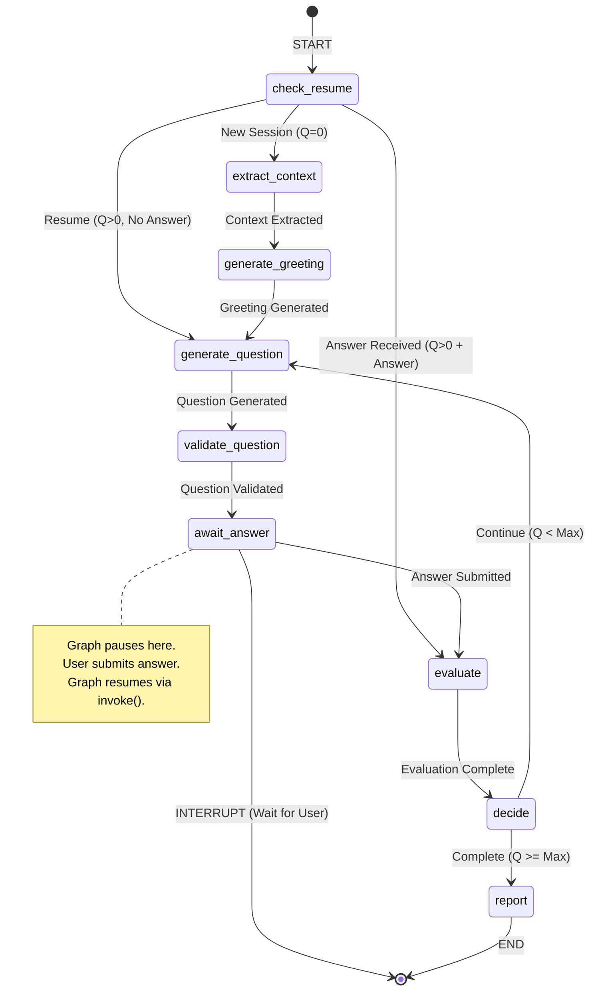
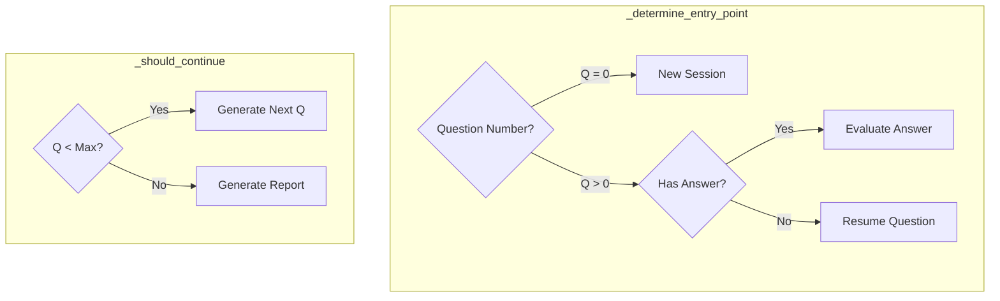

# LangGraph Interview Flow Architecture

This document visualizes the internal state machine powering the AI Interviewer's brain.

## Interview Graph (Stateful Loop)



## Node Responsibilities

| Node | Purpose | Output Keys |
|------|---------|-------------|
| `check_resume` | Route entry point | `session_id` |
| `extract_context` | Parse resume/JD | `target_role`, `phase` |
| `generate_greeting` | Personalized intro | `greeting`, `question_number` |
| `generate_question` | LLM question gen | `current_question`, `question_number` |
| `generate_question` | LLM question gen (TTD) | `current_question`, `question_number` |
| `validate_question` | Final sanity check | `current_question` |
| `await_answer` | Interrupt point | `current_answer` |
| `evaluate` | Prometheus scoring | `qa_pairs`, `performance_history` |
| `decide` | Continue/Complete | `is_complete` |
| `report` | Final summary | `final_report` |

## Conditional Routing Logic



## State Schema (InterviewState)

```python
class InterviewState(TypedDict):
    session_id: str
    candidate_name: str
    topic: str
    target_role: Optional[str]
    company_name: Optional[str]
    resume_skills: List[str]
    jd_requirements: List[str]
    experience_years: int
    question_number: int
    max_questions: int
    current_question: Optional[str]
    current_answer: Optional[str]
    qa_pairs: List[Dict[str, Any]]
    performance_history: List[int]
    candidate_state: str
    phase: str
    is_complete: bool
    greeting: Optional[str]
    final_report: Optional[Dict[str, Any]]
    messages: Annotated[list, add_messages]
```

---

*This diagram reflects the actual implementation in `src/ai_interviewer/core/interview_graph.py`.*

**Persistence:** State is checkpointed via `SqliteSaver` to `interview_state.sqlite` (configurable via `INTERVIEW_DB_PATH` env var).
